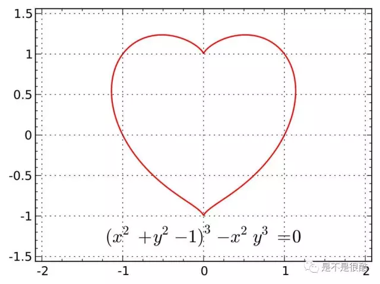
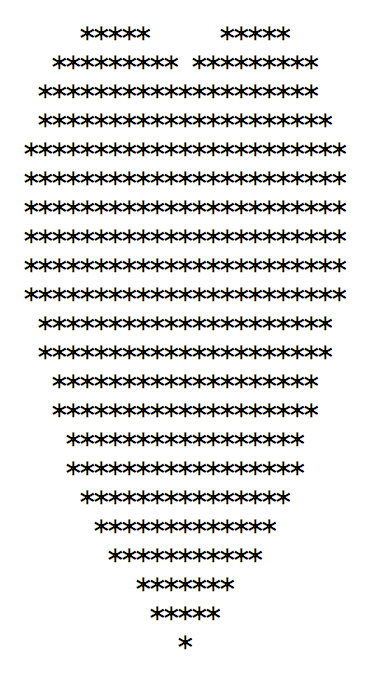
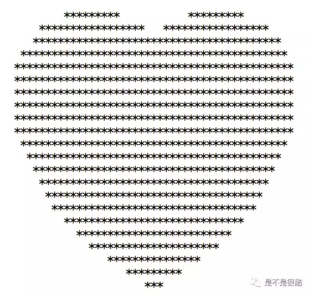
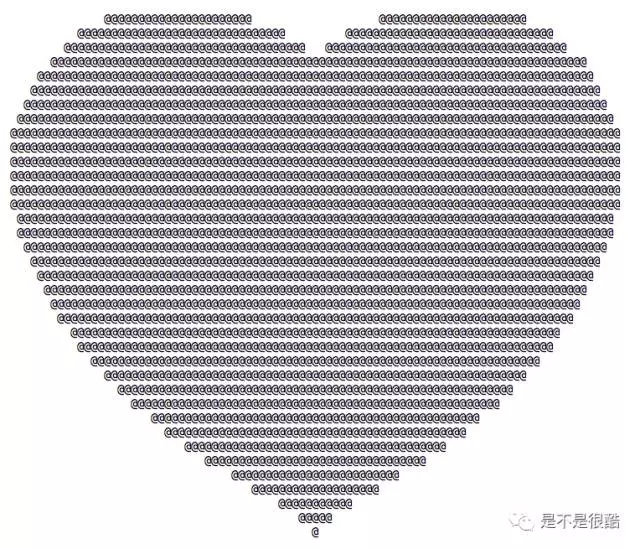
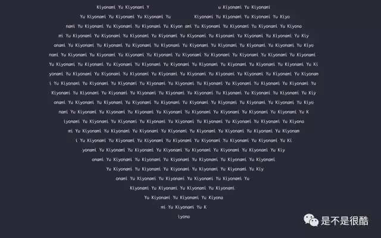

## 情人节，用C++画一个心：）

情人节到啦，作为程序员开发者，应该送给男女朋友什么礼物呢？我们这次一起用C++语言画个心作为礼物吧！（被罚跪搓衣板儿什么的概不负责= =）

在网上稍微查一查心形的曲线方程，会发现很多，最流行的曲线方程应该就是这个了：



嗯，方程看着复杂，我们不管这是怎么推导出来的（我真的不会啊= =，不过我会一个更丑的心形曲线的推导过程，大家有兴趣的话有时间给大家上一堂数学课：）），让我们使用拿来主义，直接使用吧！

我们回忆一下圆的方程，比如：x^2+y^2=1，那么所有的点(x,y)，若使得x^2+y^2==1，则这个点在这个圆的边界线上；若使得x^2+y^2<1，则这个点在圆内；若使得x^2+y^2>1，则这个点在圆外。

好了，同理，对于这个方程，若点 (x, y) 让方程左边等于0，则这个点在这个心形曲线上；若让方程左边小于0，则这个点在这个心形线内；若让方程左边大于0，则这个点在这个心形线外。

嗯，我们要做的就是写一个双重循环，遍历x和y的值，将心形线以内的地方，涂上某一个字符，比如‘*’。

那么我们首先要确定我们双重循环的边界。我们打印输出，肯定是要逐行输出，从上到下。所以我们的第一层循环要对y值做循环。观察一下，可以看到y的上界大概是1.3；下界大概是-1.1；所以，我们可以从1.3逐渐减少到-1.1，初始我们可以选取步长为0.1。同理，对于x，可以看出他的左右边界大概为-1.2和+1.2，我们就从-1.2遍历到1.2，步长也选择0.1。

我们的第一个代码就是这样的：

```
#include <iostream>
#include <cmath>
using namespace std;

int main() {

   for( float y = 1.3 ; y >= -1.1 ; y -= 0.1 ){
       for( float x = -1.2 ; x <= 1.2 ; x += 0.1)
           if( pow((x*x+y*y-1.0),3) - x*x*y*y*y <= 0.0 )
               cout<<'*';
           else
               cout<<' ';
       cout<<endl;
   }

   return 0;
}
```

是不是清晰易懂？运行一下，结果是这样的：



咦？为什么这么瘦？看来x方向要拉伸一下。怎么拉伸？其实，我们让我们的步长稍微小一点儿就好了。因为第一层循环（y值）走了多少次，决定了图像的高度（每走一次，打印一个回车）；而第二层循环（x值）走了多少次，则决定了图像的宽度（每走一次，打印一个字符）。所以，我们把x的步长缩小，x的循环就会多走几次，相应的，整个图形就会宽一些。我们将x的步长改为0.05，代码是这样的：

```
#include <iostream>
#include <cmath>
using namespace std;

int main() {

   for( float y = 1.3 ; y >= -1.1 ; y -= 0.1 ){
       for( float x = -1.2 ; x <= 1.2 ; x += 0.05)
           if( pow((x*x+y*y-1.0),3) - x*x*y*y*y <= 0.0 )
               cout<<'*';
           else
               cout<<' ';
       cout<<endl;
   }

   return 0;
}
```

结果就变成这样啦：



是不是好看了许多？

---

一旦我们掌握了这个技巧，就可以随易变换我们的这个心形的宽和高啦。比如，我让这个心形，宽和高更多一些，同时再稍微扁一点儿。y值的步长为0.06，x值的步长为0.025，就是这样的：


是不是很酷？

当然啦，如果我们填入不同的字符，可能有不同的视觉效果哦~



我们也很容易做出类似的镂空效果哦~

---

不过，你以为心形曲线只有一个方程可以描述吗？在网上多做做功课，发现相关的方程多得很：）比如这个：


我们用同样的思路，就可以编出这样的代码：

```
#include <iostream>
#include <cmath>
using namespace std;

int main() {

   for( float y = 1.3 ; y >= -1.1 ; y -= 0.06 ){
       for( float x = -1.1 ; x <= 1.1 ; x += 0.025 )
           if( x*x + pow(5.0*y/4.0-sqrt(fabs(x)),2) - 1 <= 0.0 )
               cout<<'*';
           else
               cout<<' ';
       cout<<endl;
   }

   return 0;
}
```

得到的心形是这样的，是不是曲线很不一样：）


大家可以再在网上多搜索一下，看看有没有更符合你意的心形曲线：）

熟悉其他语言，尤其是前端语言的同学，也可以利用这些方程，做出更绚丽的效果哦。尤其是使用canvas，大家不妨自己试试看，期待同学们更好的创意：）

愿天下有情人终成眷属，大家加油！


本篇文章的所有代码可以参见这个github repo: [https://github.com/liuyubobobo/heart-curve-cplusplus](https://github.com/liuyubobobo/heart-curve-cplusplus)

分享一下：我的课程群里有的同学看了这篇文章以后的创意~ 来自 @甲铁城的卡巴司机 ，他把自己的日文名字融合在了这个图案中，超赞啊！


