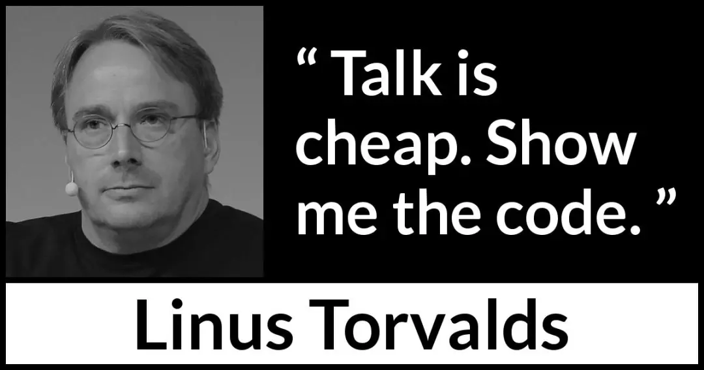
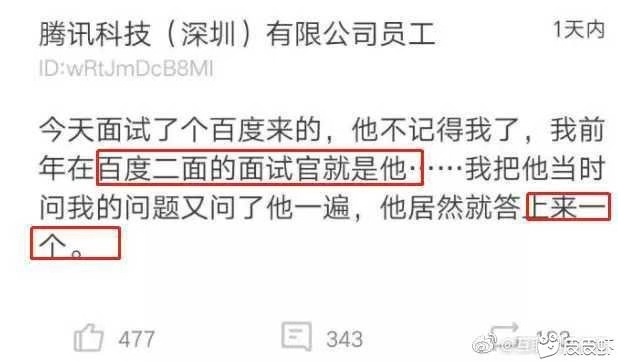
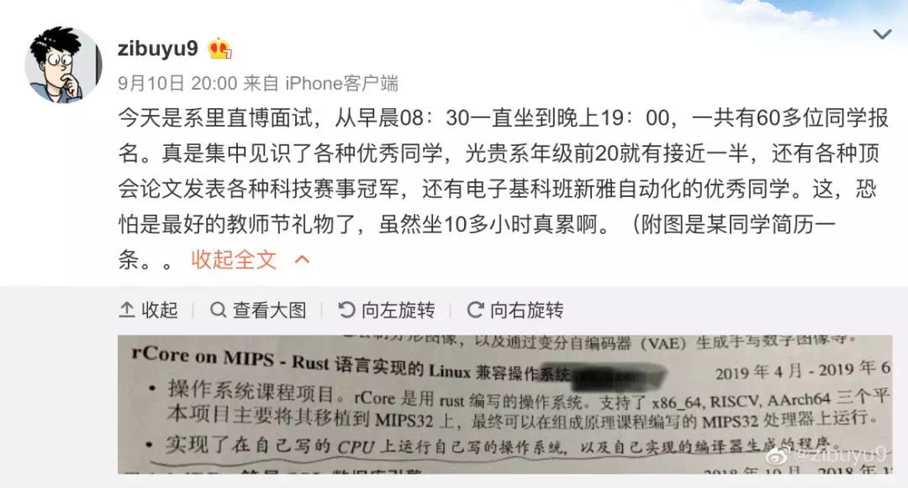

## 大厂面试为什么总考算法？以及如何避开算法面试。

**大厂面试究竟为什么总是考算法？**

很多同学都问过我这个问题，毕竟，在实际工作中，我们近乎根本不可能从底层实现一遍经典算法。我在文章[《学算法有什么用？没用》](../2019-03-18/)中说过，如果真的以工作内容为导向，算法还真可能对绝大部分同学来说没什么用。

但是，算法却是大厂面试考察的重点。甚至，极端一些，国外一些大厂只考算法。

为什么会这样？在这篇文章中，我打算系统阐述一下这个问题。相信会对你有启发。

顺便一提，**文末附赠如何绕过大厂算法面试攻略。**

 

**1.**

首先，在更早，微软还稳稳坐在老大位置上的时候，大厂的面试题完全不是现在的画风。

那是什么画风呢？请看如下问题：

* 井盖为什么是圆的？

* 为什么镜子中的景象是左右相反的，而不是上下颠倒的？

* 如何把把富士山从一个地方搬运到另一个地方？

* 有两个房间，一间房里有三盏灯，另一间房有控制这三盏灯的三个开关。这两个房间是分割开的，从一间不能看到另一间的情况。现在要求你分别进这两房间一次，然后判断出这三盏灯分别是由哪个开关控制的。

等等等等。

 

整体，这些问题和算法的关系不大，如果非要归类的话，说他们是“智力题”或许更合适。

是的，在那个时期，以微软为首的大厂，主要考“智力题”。为什么？按照微软“半官方”的说法，因为彼时计算机行业尚属新兴行业，每天都会面对很多全新的问题，处理这些问题的方式也没有一定之规。在这种情况下，微软希望选拔出最具有创造性的人才，可以灵活，创新地处理工作中遇到的各种问题。

但是，随着时间的推移，计算机行业逐渐成熟，从业人员也在呈指数级上涨。虽然创造力依然很有意义，但并不再是唯一的选拔人才的指标了。一个逻辑思维强，基本功扎实的人，也能够非常好地胜任软件工程师的角色。至此，互联网大厂的面试进入了第二阶段，以算法问题为主。

这并不是坏事儿。因为这意味着计算机行业不再是“天才”才能涉足的领域。普通人通过训练学习，也可以进入。与此同时，这意味着计算机行业门槛降低。一个行业门槛的降低，意味着这个行业可以成规模的扩张。这也就是大家现在看到的互联网欣欣向荣的景象了。

值得一提的是，微软招聘了那么多“可以创造性解决问题的人才”，但也逃不过在创新性上被 Google，Apple 等企业反超的命运。所以，这样的人才选拔策略是否合理，也很值得商榷。比尔盖茨曾经很认真地反省过这件事情。

不管怎样，“智力面试题的盛行”，早已成为了历史。

 

**2.**

为什么当下，大厂面试主要考核算法问题？这里要说一点点人才选拔的理论。

简单地说，在 HR 领域，一个公认的人才选拔模型，由三部分组成。

1. 通用问题思考能力；

2. 专业能力；

3. 人品，三观，等等。

“人品，三观”很好理解，这篇文章不谈。

“专业能力”也很好理解，想当医生，各种医学知识应该了解；想当律师，各种法律条文应该了解。同理，搞计算机的，至少要会写代码，不能是“口头工程师”。

至于“通用问题思考能力”，简单来说，就是把专业能力拿去，看一个人遇到一个非专业的问题，水平如何。这是一个很大的范畴，想象力，创造力，反应力，记忆力，归纳总结能力，表达能力，等等等等，都能装进这个篮子里。上面列举的微软的“智力题”，从很大程度上，是在考察“通用问题思考能力”。

当下，大部分互联网企业比较认可的结论是：算法面试问题，可以很好地同时顾及“通用问题思考能力”和“专业能力”的考察。

说算法问题可以很好地考察“专业能力”很好理解。为什么说算法问题能很好地考察“通用问题思考能力”？

因为，解决算法问题是一个典型的“学以致用”的过程。对于计算机专业的同学来说，近乎大一大二两年，就已经将基本的算法和数据结构学习完了。数据结构大体就那么多；经典算法大体就那么多；算法设计思想也就那么几类。但是，面试者能否综合这些知识，解决一个一个算法问题？相信大家都明白，这并没有那么简单。

而实际上，在计算机的世界中，我们经常面对类似的情况。各类语言就摆在这里；各种 API 文档上写得一清二楚；各种工具也都唾手可得，从数据库，到数据平台；从正则表达式，到云计算服务；github 上各类开源项目应有尽有。我们能否合理组合这一切，完成我们想要的功能？

解决算法问题，近乎就是这个解决问题模型的缩影。

 

**3.**

当然，还有一类面试问题，可以更好地模拟这种“真实的问题”，那就是系统设计类问题。实际上，很多企业也会大量地考察系统设计类问题。比如以下问题：

* 如何设计一个 Google？

* 如何设计一个 Facebook？

* 如何设计一个 Youtube？

* 如何设计一个短地址生成服务？

* 如何设计一个通知系统？

等等等等。

 

但是，如果仅仅考察系统设计问题，最大的缺点是容易流于“表象”。

比如，很多同学都知道，面对性能问题，我们可以使用缓存机制（Cache），或者进行并行处理。但是，具体在实现一个缓存机制或者进行并行处理的过程中，可能会出现什么问题？仅仅用自然语言描述，很多时候都是不够的。

可在短短的面试过程中，近乎不可能让每一个面试者都真地实现一个完整的缓存机制或者并行模型。因此，**对于系统设计问题的考察，通常很难触及到代码层面。**

但是，对于软件工程师来说，正确地实现代码，比知道几个诸如“缓存机制”或者“并行处理”这样的名词重要多了。很多人说起这样的概念头头是道，但真的写起代码来，就原形毕露了。

所谓 **Talk is cheap, show me the code**。

算法面试相较而言，虽然问题规模会更小，问题本身也更有局限性，但能考察出程序员真刀真枪写代码的能力。

 

**4.**

不要说系统设计问题，其实，就算是算法问题，相信很多同学也都有体会。**对于一个问题，描述它的解决思路是容易的，但真要落实到代码，完成正确的逻辑，就不那么容易了。**

对于一个具体的工程问题，没有受过专业训练的人，很容易忽略复杂的细节，将问题想简单。毕竟，盖一个房子不过是建四面墙，上面加个屋顶而已。但是，这么一个简单的“盖房子”的工程问题，凝聚了人类几千年的智慧结晶，里面包含了诸多复杂的工程问题。从地基要挖多深，到屋体架构设计；从承重墙的构建，到具体施工材料的选择。**外行看来很简单的问题，实际上是很复杂的。**

计算机专业也是如此。排行榜不就是排个序吗？但能否达到性能标准？搜索引擎不就是把互联网上相关的信息展现出来吗？但是怎么定义“相关信息”。互联网这么大，怎么快速响应？这些都是实打实的问题，外行想不到，只有内行才能理解其中的难点。

 

我在[《神一样的随机算法》](../2019-07-09/)这篇文章中，向大家介绍了 Knuth Shuffle 算法。很多同学说，这很简单啊。因为这个算法本质就是从一堆元素中，每次随机取一个，然后将这个元素删除，再随机取一个，再删除，以此类推。

但如果考虑具体的实现，我们遇到的问题就是，这堆元素要怎么存储？如果我们放在一个链表中，每次删除的性能太差；但如果我们放在哈希表或者红黑树中，又不能高效实现“随机取一个元素”的操作。Knuth Shuffle 极其巧妙地在数组中高效完成了这一切任务。

 

再举一个例子，Kruskal 最小生成树算法，思想也非常简单。对所有边排序，之后从小到大选边，只要和已有的边没有形成环，就选择，否则抛弃。这么一个简单的描述，但落实到具体代码中，怎么判断“是否和已有的边形成环”，并不那么容易。

实际上，在历史上，Kruskal 算法的思想很早就出现了，但是，一直没有一个高效的实现方式。直到人们意识到可以用并查集进行“环检测”，Kruskal 才成为了一个“实用的算法”。

 

现在，还有很多算法思想，人们还没有找到高效的实现。有机会再和大家分享。现阶段，这些“没有好的实现”的算法思想并不实用。因为，软件工程师的核心价值，是具体用代码实现出功能，而不是侃侃而谈思想或者概念。

 

**5.**

当然了，如果遇到真才实学的面试官，面试者随便吹几个概念，其实也不可能蒙混过关。有经验的面试官一定能深入问出面试者的水平。但是，这对面试官的要求太高了。

对于任何一个企业来说，高水平的软件工程师，他的主要时间应该用来完成工程设计，而不是去面试。更何况，现如今，互联网企业规模急速扩大，一个企业一天可能几十上百场面试，怎么可能有那么多高水平的面试官？

这样一来，**算法面试的另一个优势就体现出来了：对于面试官来说，好准备。**

对于系统设计问题来说，通常，面试官的水平要远远高于面试者，才能真实地鉴别出面试者的能力。但是，对于算法问题来说，即使面试官的算法水平低于面试者，也可以进行考核。因为面试官可以直接看答案，理解清楚解题思路和代码就好了。

正因为如此，会出现下图这样的事情。虽然可能是段子，但是，这背后反映的事实是真实的。

一个算法面试官问你一个算法问题，你答不好，不代表他比你强。因为你们处于信息不对等的位置。

 

**6.**

除此之外，算法面试还有更多优点。

比如，**语言无关**。不管是编译型语言，还是脚本语言；不管是什么编程范式为主的语言；也不管是开发 iOS 还是 Android 还是前端还是后端的语言，都能用来解决算法问题；

同时，考察算法问题，**对”硬件条件“要求也很低**。并不需要非常特定的环境或者配置；在公司的会议室可以完成，找个咖啡厅也能完成；面对面可以完成，远程也可以完成。没有电脑？拿张纸都可以开始。对，我说的就是白板编程。

另外，使用算法问题，可以很容易地比较面试者的水平差异。其他领域的问题，很难像算法问题一样，在不同难度级别上，产生这么多看似完全不重复的问题。不管是深度还是广度，不管是简单的还是难的，总会有合适的算法问题让面试官选择，以测试出你的水平上限；

也正因为算法问题的选择很多，所以，使用算法面试，非常容易**成规模**地进行招聘。在一段时间里进行几百场面试，题目不会重样。这样，避免了泄题的问题。

 

**7.**

那么，算法面试有没有缺点呢？当然有。最大的缺点，我在我的文章[《第一类错误和第二类错误》](../2019-09-26/)中提到过，就是容易产生 False Negative ，也就是漏过人才。因为，不擅长算法的人，不意味着不胜任计算机专业的工作。

**大厂错过了人才怎么办？答案可能有点儿扎心：他们不在乎。**

反正有简历源源不断地涌进来。大厂招聘的目的并不是不错过每一个人才，而是招聘到足够数量满足自己需要的人才。

通常来讲，擅长算法的人，近乎都能够很好地胜任软件工程师的工作。反之，不擅长算法的人，虽然有可能是人才，但更有可能不是人才。相较而言，大厂更害怕将蠢材误判为人才招进来。

 

**8.**

那么，在什么情况下，算法面试对于企业来说，不是好的选择？

典型的情况就是：企业不需要考察“通用问题解决能力”。这就是很多小公司面试不考算法的原因。小公司更注重专业能力的考察。能干活最重要。他们并不会接触到那么多“全新的，创造性的问题”。

对于大厂，也有不适合考算法的情况。那就是：企业期望招聘的人才，是一个专门领域的人才。比如，企业想招聘一个数据库专家，面试问题却是一堆动态规划，这是不合适的。

对于很多公司，比如 Google，即使招聘领域专家，也会考察算法问题，但难度明显降档。最典型的就是 Google 在面试 Homebrew 的作者 Max Howell 的时候，给出的算法面试题只是“翻转二叉树”这么简单而已。这个问题在 Leetcode 上只是一个 easy 的问题。

（不过，Google 因为 Max Howell 没有很好地回答这个算法问题而拒绝了这位 iOS 界的大牛。这里面的故事，以后有机会和大家分享。）

 

**9.**

所以，**进大厂绕过算法面试的方式是什么？**

**就是成为领域专家。让企业不能把你当做是一个普通的求职者，使用一般通用的流程去面试。**

“领域专家”这个词听起来很吓人，但其实，可能并没有大家想得那么复杂。

在我的学生中，有同学曾经面对大厂面试官的算法问题，霸气回应“算法我不懂，架构设计随便问”，最终成功进了大厂；

有同学自己做了一个简易的操作系统内核，成功进大厂；

有同学上架了一款非常成功的 iOS 应用，国内拿奖无数，还被苹果邀请参加了 WWDC 开发者大会。甚至，严格意义上，他是一名非科班的同学，但最终，毫无悬念地走入大厂；

也有同学，本科都没读，阴错阳差，研究起了外挂，圈内小有名气，最终只是高中学历，走入大厂安全核心部门；

这样的例子太多太多。这些例子里的同学，都不是每个领域数一数二的专家。但是，从企业的角度看，已经算是“领域专家”了。

 

最近，有一个新闻刷屏了，清华一个学霸，在自己写的CPU上运行自己写的操作系统，以及用自己实现的编译器生成的程序。当然，这里面可能还有很多细节需要考察，但是，这样的人才，大厂一定是开绿灯的。

 

实际上，我个人认为：在面试中，更多地考察操作系统，编译原理，网络基础等等知识，是更加合理，也是更实用，有意义的。对这些领域的考察，也完全可以涵盖算法。但是，缺点就在于，这些领域，很难有千变万化的题目。毕竟，Google 有一个规矩，泄露出去的面试题，不会出现第二次的。

但是，摆出在这些领域的成绩，是不可能被任何一个大厂忽略的。

 

**10.**

大家可以看出来，我所谓的“绕过大厂算法面试”的方式，就是成为“领域专家”。有没有觉得自己上当受骗了？

至少在我看来，成为“领域专家”，是比掌握那些基本的算法面试问题要难的。

但是，很多时候，现实就是这样。我们对现实不满，苦苦追求其他“捷径”。但是，其他的路其实是更艰苦的路。而**我们总容易忽略，摆在眼前的道路，其实，已经是捷径了。**

 

**大家加油！**